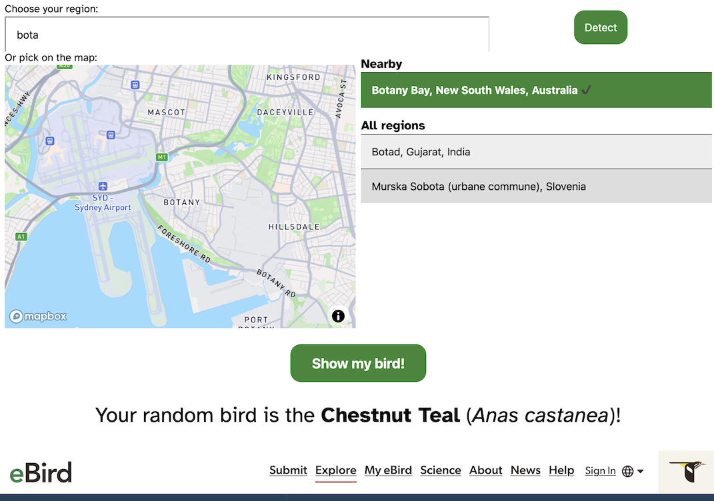

# Local random bird

eBird can [generate a random bird](https://ebird.org/species/surprise-me), but only from the full list of bird species. Getting a local bird is much nicer.

Pick your region:
- Search the list of eBird regions
- Or use the autodetect feature (uses geolocation)
- Or pick a spot on the map (uses MapBox)

…then click the big friendly button to see your assigned bird.

VanillaJS, no installed dependencies: just serve the root directory locally.
